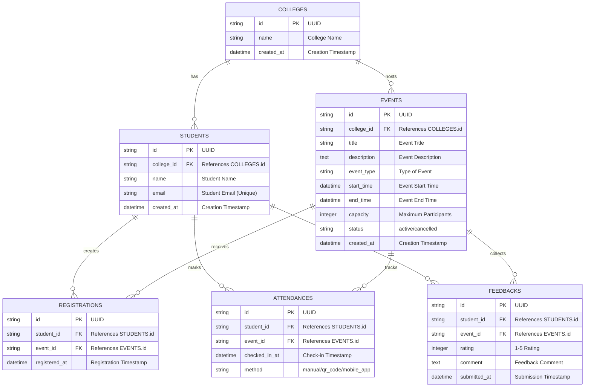

# Campus Event Management Platform - ER Diagram

## Database Schema

## Relationships

1. **One-to-Many Relationships:**
   - College → Students (one college has many students)
   - College → Events (one college hosts many events)
   - Student → Registrations (one student can register for many events)
   - Event → Registrations (one event can have many registrations)
   - Student → Attendances (one student can attend many events)
   - Event → Attendances (one event can have many attendances)
   - Student → Feedbacks (one student can give feedback for many events)
   - Event → Feedbacks (one event can receive many feedbacks)

2. **Unique Constraints:**
   - (student_id, event_id) in REGISTRATIONS (one registration per student per event)
   - (student_id, event_id) in ATTENDANCES (one attendance record per student per event)
   - (student_id, event_id) in FEEDBACKS (one feedback per student per event)
   - email in STUDENTS (unique email per student)

3. **Business Rules:**
   - Students can only register for events at their college
   - Students must be registered to mark attendance
   - Students must have attended to submit feedback
   - Ratings must be between 1 and 5
   - Event capacity limits the number of registrations

## Data Types

- **UUIDs**: All primary keys use UUID format for better scalability
- **Timestamps**: All datetime fields use UTC timezone
- **Text Fields**: Descriptions and comments use TEXT type for longer content
- **Integers**: Ratings and capacity use INTEGER with constraints
- **Enums**: Status and method fields use string enums for consistency
