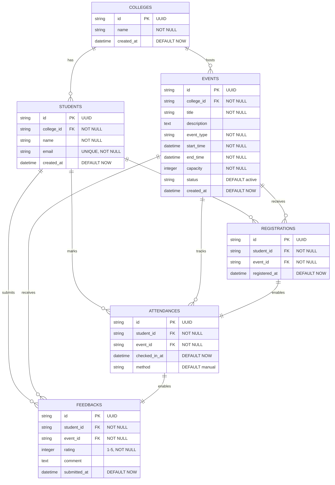
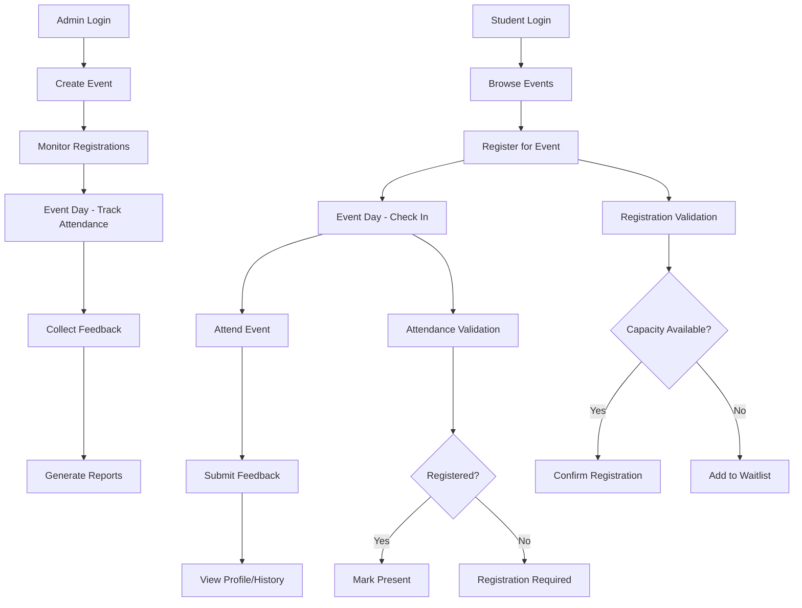

# Campus Event Management Platform - Design Document

## Overview
A comprehensive event management system for colleges to organize events and track student participation across multiple institutions.

## System Architecture

### Technology Stack
- **Backend**: Flask (Python) with SQLAlchemy ORM
- **Database**: SQLite (development) / PostgreSQL (production)
- **Frontend**: React.js with Tailwind CSS and Framer Motion
- **API**: RESTful API with JSON responses
- **Authentication**: Mock authentication (extensible to JWT/OAuth)

### Design Principles
- **Scalability**: UUID-based primary keys, modular architecture
- **Maintainability**: Clean separation of concerns, comprehensive documentation
- **Extensibility**: Plugin-ready architecture for future enhancements
- **Performance**: Optimized queries, efficient data structures

## Database Design

### Entity Relationship Diagram



### Key Constraints
- **Unique Constraints**: 
  - `(student_id, event_id)` in registrations, attendances, feedbacks
  - `email` in students table
- **Foreign Key Constraints**: All relationships properly enforced
- **Check Constraints**: Rating between 1-5, valid event status
- **Business Rules**: Registration → Attendance → Feedback workflow

## API Design

### RESTful Endpoints

#### Core Resources
```
POST   /api/colleges                    # Create college
GET    /api/colleges                    # List colleges

POST   /api/students                    # Create student
GET    /api/students                    # List students (with filters)

POST   /api/events                      # Create event
GET    /api/events                      # List events (with filters)
PUT    /api/events/{id}                 # Update event
DELETE /api/events/{id}                 # Cancel event
```

#### Event Interactions
```
POST   /api/events/{id}/register        # Register for event
POST   /api/events/{id}/attendance      # Mark attendance
POST   /api/events/{id}/feedback        # Submit feedback
```

#### Reporting
```
GET    /api/reports/event_popularity    # Event popularity report
GET    /api/reports/event/{id}/attendance # Event attendance details
GET    /api/reports/student/{id}        # Student participation summary
GET    /api/reports/top_active_students # Top active students
```

### API Response Format
```json
{
  "data": { ... },           // Success response
  "error": "message",        // Error response
  "timestamp": "ISO_DATE",   // Request timestamp
  "status": "success|error"  // Response status
}
```

## User Workflows

### Student Workflow
1. **Registration**: Student creates account or logs in
2. **Event Discovery**: Browse available events with filters
3. **Event Registration**: Register for interesting events
4. **Event Attendance**: Check-in at event venue
5. **Feedback Submission**: Rate and review attended events
6. **Profile Management**: View participation history

### Admin Workflow
1. **College Setup**: Create college profile
2. **Event Creation**: Create and manage events
3. **Event Monitoring**: Track registrations and attendance
4. **Report Generation**: Analyze event performance
5. **Student Management**: View student participation
6. **Analytics Dashboard**: Monitor overall metrics

### System Workflow


## Business Rules

### Registration Rules
- Students must be registered before attending
- No duplicate registrations allowed
- Event capacity limits enforced
- Registration deadline enforcement (optional)

### Attendance Rules
- Only registered students can mark attendance
- One attendance record per student per event
- Multiple check-in methods supported (manual, QR, mobile)

### Feedback Rules
- Only students who attended can submit feedback
- Rating must be between 1-5
- One feedback per student per event
- Comments are optional

### Data Integrity Rules
- All foreign key relationships enforced
- Cascade deletes for dependent records
- Audit trail for critical operations
- Data validation at API and database levels

## Scalability Considerations

### Database Scaling
```sql
-- Horizontal partitioning by college_id
CREATE TABLE events_college_1 PARTITION OF events 
FOR VALUES IN ('college-uuid-1');

-- Indexing strategy
CREATE INDEX idx_events_college_type ON events(college_id, event_type);
CREATE INDEX idx_registrations_student ON registrations(student_id);
CREATE INDEX idx_attendances_event_date ON attendances(event_id, checked_in_at);
```

### Application Scaling
- **Microservices**: Split into event, user, and reporting services
- **Caching**: Redis for frequently accessed data
- **Load Balancing**: Multiple Flask instances behind nginx
- **CDN**: Static assets and images
- **Database**: Read replicas for reporting queries

### Performance Optimizations
- **Query Optimization**: Proper indexing and query planning
- **Connection Pooling**: Database connection management
- **Async Processing**: Background jobs for reports
- **Data Archiving**: Move old events to archive tables

## Security Considerations

### Authentication & Authorization
- JWT tokens for API authentication
- Role-based access control (Student, Admin, Super Admin)
- Session management and timeout
- Password hashing with bcrypt

### Data Protection
- Input validation and sanitization
- SQL injection prevention (parameterized queries)
- XSS protection in frontend
- CSRF tokens for state-changing operations
- Rate limiting on API endpoints

### Privacy Compliance
- GDPR compliance for EU students
- Data retention policies
- User consent management
- Right to be forgotten implementation

## Deployment Architecture

### Development Environment
```yaml
services:
  backend:
    build: ./Backend
    ports: ["5000:5000"]
    environment:
      - FLASK_ENV=development
      - DATABASE_URL=sqlite:///campus_events.db
  
  frontend:
    build: ./frontend
    ports: ["3000:3000"]
    depends_on: [backend]
```

### Production Environment
```yaml
services:
  nginx:
    image: nginx:alpine
    ports: ["80:80", "443:443"]
    
  backend:
    image: campus-events-api:latest
    replicas: 3
    environment:
      - FLASK_ENV=production
      - DATABASE_URL=postgresql://user:pass@db:5432/campus_events
      
  database:
    image: postgres:13
    environment:
      - POSTGRES_DB=campus_events
      - POSTGRES_USER=campus_user
      - POSTGRES_PASSWORD=secure_password
    volumes:
      - postgres_data:/var/lib/postgresql/data
```

## Testing Strategy

### Unit Tests
- Model validation tests
- API endpoint tests
- Business logic tests
- Database constraint tests

### Integration Tests
- End-to-end user workflows
- API integration tests
- Database integration tests
- Frontend-backend integration

### Performance Tests
- Load testing with multiple concurrent users
- Database performance under load
- API response time benchmarks
- Memory usage profiling

## Monitoring & Analytics

### Application Monitoring
- Error tracking with Sentry
- Performance monitoring with New Relic
- Log aggregation with ELK stack
- Health checks and uptime monitoring

### Business Analytics
- Event popularity trends
- Student engagement metrics
- College participation rates
- Feedback sentiment analysis

## Future Enhancements

### Phase 2 Features
- Real-time notifications (WebSocket)
- QR code check-in system
- Email/SMS notifications
- Calendar integration (Google, Outlook)
- Mobile app (React Native)

### Phase 3 Features
- AI-powered event recommendations
- Social features (event sharing, comments)
- Payment integration for paid events
- Multi-language support
- Advanced analytics dashboard

### Phase 4 Features
- Machine learning for attendance prediction
- Automated event scheduling
- Integration with learning management systems
- Virtual event support
- Advanced reporting with data visualization

## Risk Assessment

### Technical Risks
- **Database Performance**: Mitigated by proper indexing and query optimization
- **Scalability Bottlenecks**: Addressed through horizontal scaling design
- **Data Loss**: Prevented by regular backups and replication
- **Security Vulnerabilities**: Minimized through security best practices

### Business Risks
- **User Adoption**: Addressed through intuitive UI/UX design
- **Data Privacy**: Managed through compliance frameworks
- **System Downtime**: Minimized through redundancy and monitoring
- **Feature Creep**: Controlled through agile development practices

## Conclusion

This design provides a solid foundation for a scalable, maintainable campus event management platform. The modular architecture allows for incremental development and easy extension of features. The comprehensive API design ensures flexibility for various client applications, while the robust database design maintains data integrity and supports complex reporting requirements.

The system is designed to handle the specified scale (50 colleges, 500 students per college, 1000+ events) while providing room for significant growth. The technology choices balance development speed with long-term maintainability and performance requirements.
